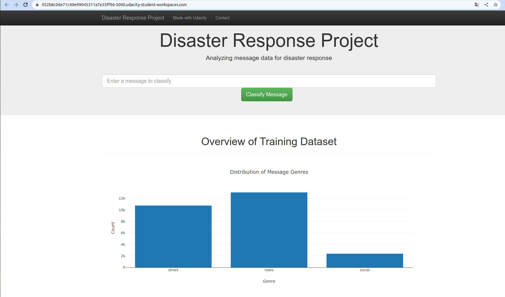
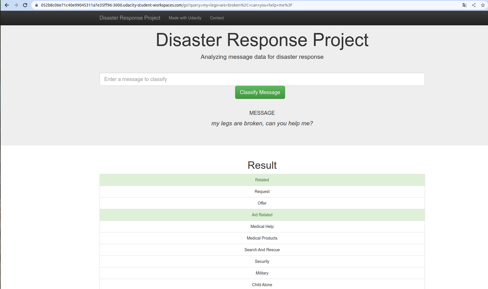

# Disaster Response Pipeline Project

### Introduction:

Disaster Response Pipeline Project is a web app project that integrates machine learning to categorize response messages into 36 pre-existing categories related to disasters.

 

### Project structure:

This project is built with the following structure:

- app
  | - template
  | |- master.html # main page of web app
  | |- go.html # classification result page of web app
  |- run.py # Flask file that runs app

- data
  |- disaster_categories.csv # data to process
  |- disaster_messages.csv # data to process
  |- process_data.py
  |- DisasterResponse.db # database to save clean data to

- models
  |- train_classifier.py
  |- classifier.pkl # saved model
  
- README.md

### Instructions:

1. Run the following commands in the project's root directory to set up your database and model.

   - To run ETL pipeline that cleans data and stores in database
     `python data/process_data.py data/disaster_messages.csv data/disaster_categories.csv data/DisasterResponse.db`
   - To run ML pipeline that trains classifier and saves
     `python models/train_classifier.py data/DisasterResponse.db models/classifier.pkl`
2. Go to `app` directory: ` cd app`
3. Run your web app: `python run.py`
4. Click [http://0.0.0.0:3000/](http://0.0.0.0:3000/) to open the homepage

### **License**

[MIT](https://github.com/lexuansanh)
